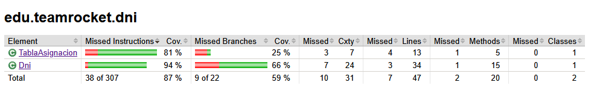

Dni kata (Java)
==================

- [Introducción](#introducción)
- [Manual](#manual)
    - [Requisitos](#requisitos)
    - [Instalación](#instalación)
- [Implementación](#implementación)
- [Pruebas](#pruebas)
    - [Casos test](#casos-test)
    - [Jacoco](#jacoco)

## Introducción

Este kata ha sido completado por [**Dalila Teodosio**](https://github.com/DalilaManu) y [**Pablo González**](https://github.com/Pistacho14), dos alumnos de 1º de DAM en el centro escolar [**IES de Teis**](https://www.edu.xunta.gal/centros/iesteis/). Esta app crea DNIs aleatorios y comprueba si tanto la parte numérica como la alfabética son correctos en función a las [normas establecidas por el gobierno español](https://es.wikipedia.org/wiki/Documento_nacional_de_identidad_(Espa%C3%B1a)). Este proyecto ya había sido completado en Python y hemos decidido traducirlo a Java para mejorar nuestro conocimiento de dicho lenguaje de programación.

## Manual

### Requisitos

Los requisitos para el funcionamiento son:
- [Java 21+](https://www.java.com/es/).
- [Maven](https://maven.apache.org/).
- [Git](https://git-scm.com/).

### Instalación

### Linux

Clona el repositorio de github:

`git clone https://github.com/Pistacho14/kata-dni-java`

Instala Java:

`sudo apt install openjdk-21-jdk`

Instala Maven:

`sudo apt install maven`

Crea el paquete:

`mvn clean package`

Para lanzar la aplicación usa el comando:

`java -jar .\target\kata-dni-java-1.0-SNAPSHOT.jar`

### Windows

Clona el repositorio de github:

`git clone https://github.com/Pistacho14/kata-dni-java`

Instala Java:

`winget install EclipseAdoptium.Temurin.21.JDK`

Instala Maven:

`winget install Apache.Maven`

Crea el paquete:

`mvn clean package`

Para lanzar la aplicación usa el comando:

`java -jar .\target\kata-dni-java-1.0-SNAPSHOT.jar`

## Implementación

En este proyecto se ha usado:
- [Java](https://www.java.com/es/)
- [Junit](https://junit.org/jacoco)
- [Jacoco](https://github.com/jacoco/jacoco)
- [Apache commons](https://commons.apache.org/)

## Pruebas

### Casos test

A excepción de App que ya funciona de por si como un caso test, ambas clases [Dni](src/main/java/edu/teamrocket/dni/Dni.java) y [TablaAsignación](src/test/java/edu/teamrocket/TablaAsignacionTest.java) han sido testeadas con sus respectivos casos test.

### Jacoco

Este es el reporte de Jacoco sobre el código, los fragmentos de código que no se utilizan provienen de los métodos toString y el control de excepciones.

